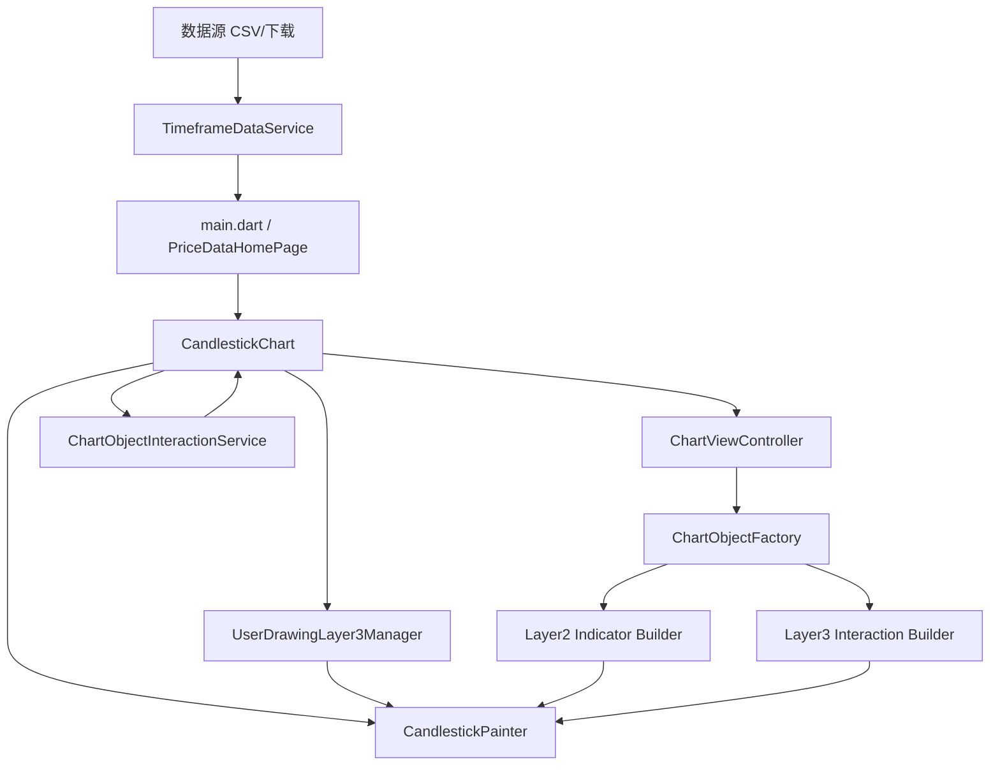
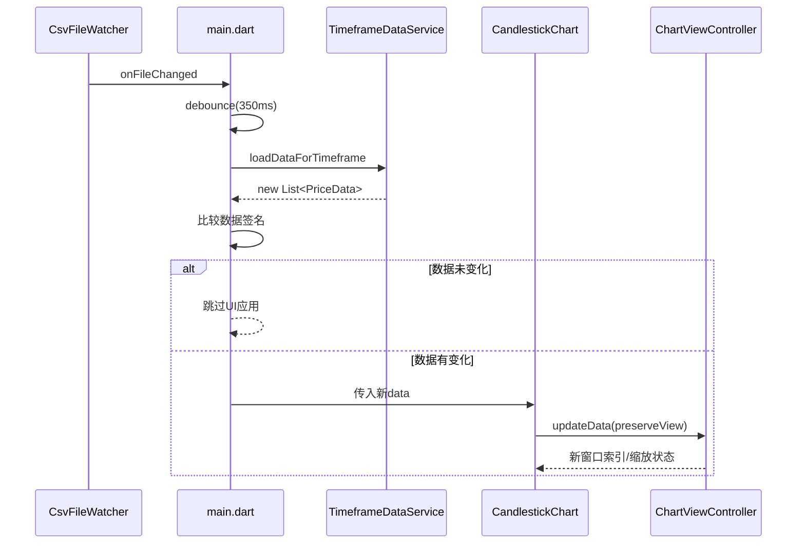
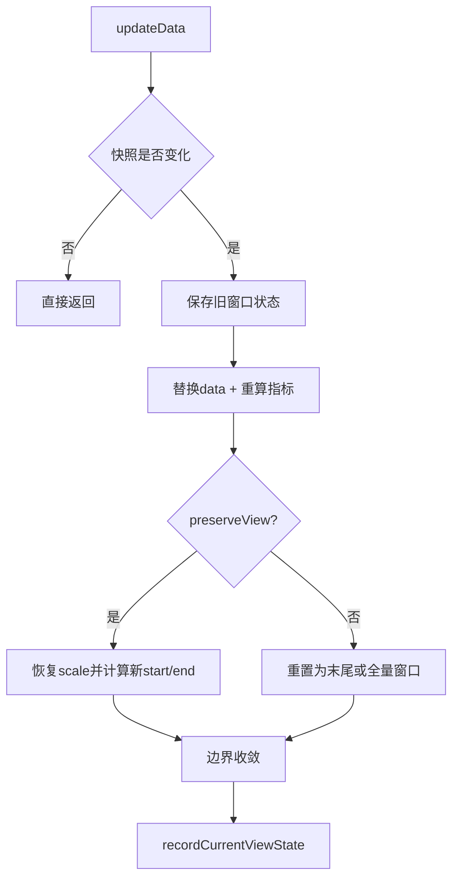
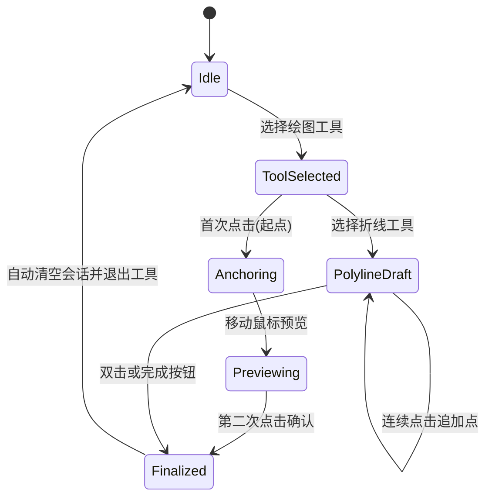
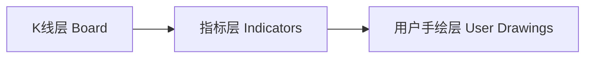
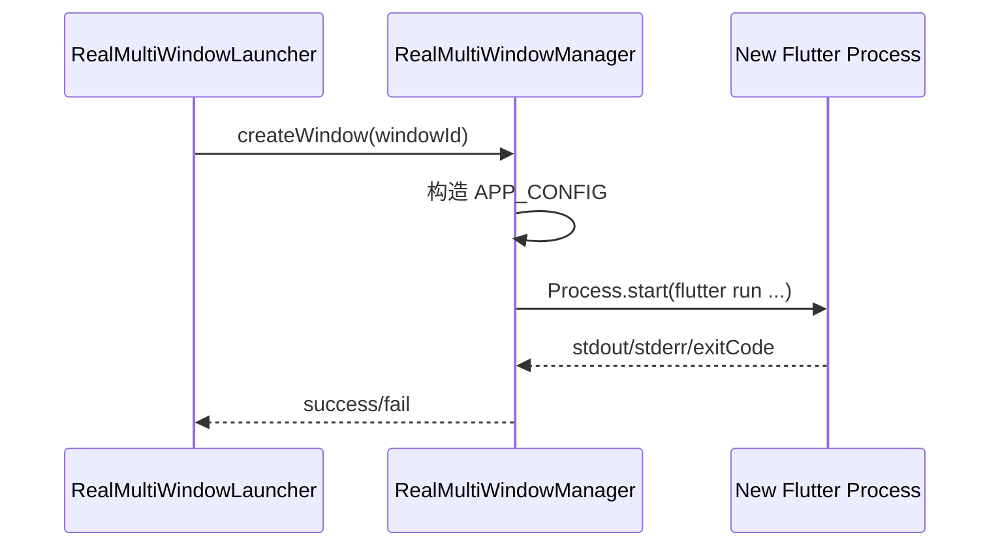
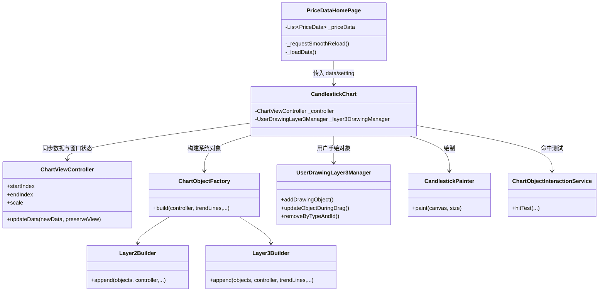
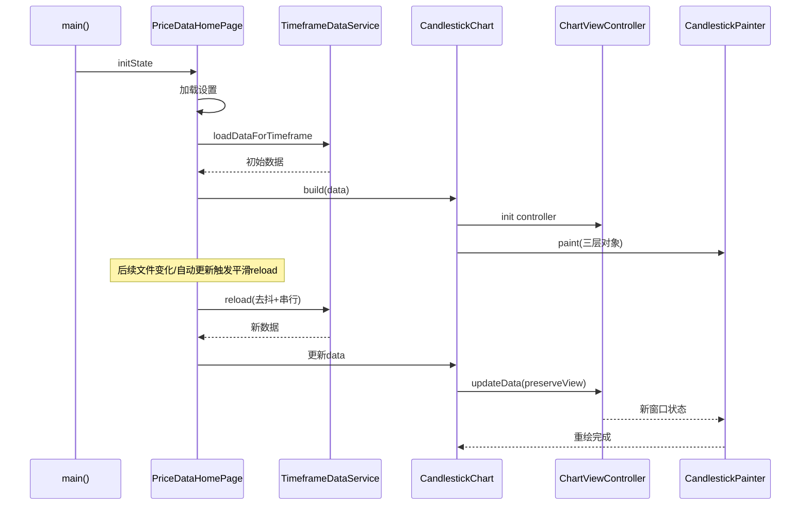

# flutterMarket 业务逻辑总览（核心优先）

## 1. 先讲核心逻辑（最重要）

如果只记住一件事：

- **这个系统本质是“数据流驱动的图表状态机”**。数据变化进入后，经过主页面与图表控制器协同，最终转成三层渲染对象并绘制到画布。

核心闭环只有四步：

1. **数据输入**：CSV 文件变化、手动下载、自动更新、周期/品种切换。
2. **状态协调**：`main.dart` 管理数据加载节奏与去抖；`ChartViewController` 管理可视窗口（start/end/scale）与指标缓存。
3. **对象组装**：`ChartObjectFactory` + Layer2/Layer3 builder 将业务数据变成可渲染对象。
4. **分层渲染与交互**：`CandlestickPainter` 三层绘制；`ChartObjectInteractionService` 命中测试；`UserDrawingLayer3Manager` 维护用户手绘对象与拖拽更新。

---

## 2. 全局架构图

---

## 3. 关键模块职责（按“从外到内”）

### 3.1 页面入口层

- [lib/main.dart](../lib/main.dart)
  - 应用入口与主业务编排。
  - 管理 `_priceData`、时间周期、交易对、设置项。
  - 负责 **平滑刷新策略**（去抖、串行、跳过未变化数据）。
  - 负责文件监听（`CsvFileWatcher`）和自动更新定时器。

### 3.2 图表组件层

- [lib/widgets/candlestick_chart.dart](../lib/widgets/candlestick_chart.dart)
  - 管理图表 UI 交互（滚轮、拖拽、点击、绘制工具选择）。
  - `didUpdateWidget` 中将数据变更同步给 `ChartViewController`。
  - 将 Layer2/Layer3 对象与预览对象组合后交给 Painter。

- [lib/widgets/candlestick_chart_interaction_coordinator.dart](../lib/widgets/candlestick_chart_interaction_coordinator.dart)
  - 拆分 pointer/scale 相关交互流程，主组件更薄。

### 3.3 状态与算法层

- [lib/widgets/chart_view_controller.dart](../lib/widgets/chart_view_controller.dart)
  - 图表的核心状态机：`startIndex/endIndex/scale`。
  - 数据更新策略：保视图、跟随最新、边界收敛、指标重算。
  - 提供各类控制器混入（MA、BB、wave、selection、zoom 等）。

- [lib/services/user_drawing_layer3_manager.dart](../lib/services/user_drawing_layer3_manager.dart)
  - Layer3 手绘对象集合（趋势线、圆、矩形、Fib、折线）。
  - 统一新增/删除/按类型拖拽更新/趋势线长度与角度调整。

### 3.4 对象组装与渲染层

- [lib/services/chart_object_factory.dart](../lib/services/chart_object_factory.dart)
  - 统一组装入口（orchestrator）。

- [lib/services/chart_object_layer2_indicator_builder.dart](../lib/services/chart_object_layer2_indicator_builder.dart)
  - 指标层对象（波浪点、过滤点、分析趋势线、拟合曲线等）。

- [lib/services/chart_object_layer3_interaction_builder.dart](../lib/services/chart_object_layer3_interaction_builder.dart)
  - 交互层对象（竖线、趋势线、选区、活动选区）。

- [lib/widgets/candlestick_painter.dart](../lib/widgets/candlestick_painter.dart)
  - 三层渲染总入口：
    1) K线层
    2) 指标层
    3) 用户手绘层

- [lib/services/chart_object_interaction_service.dart](../lib/services/chart_object_interaction_service.dart)
  - 统一命中测试与拖拽目标识别（start/end/body）。

---

## 4. 核心数据刷新逻辑（重点）

### 4.1 为什么你之前会感觉“刷新不平稳”

典型原因是三件事叠加：

- 文件变化事件短时间连续触发。
- 每次触发都可能执行完整数据加载并引发整页重绘。
- 即使数据内容没变，也可能因为新列表对象导致下游重算。

### 4.2 当前稳定策略（现状）

主页面采用“**去抖 + 串行 + 跳过未变化**”：

- 去抖：短时间内多次文件事件合并为一次刷新。
- 串行：同一时刻只允许一个 reload，后续请求排队。
- 跳过未变化：用签名（长度 + 首末时间戳）判断是否真的变了。

### 4.3 `ChartViewController.updateData` 语义

- 输入：新数据列表 + `preserveView`。
- 行为：
  - 先做快照变化判断，无变化直接返回。
  - 变化时重算指标缓存。
  - 尽量保持原视窗（scale/start/end）；若之前跟随最新，则继续跟随。
  - 所有索引做边界收敛，避免越界抖动。

---

## 5. 图表交互与绘制逻辑

### 5.1 交互主线

- 鼠标/手势事件进入 `CandlestickChart`。
- 命中对象由 `ChartObjectInteractionService.hitTest` 决策。
- 拖拽更新委托给 `UserDrawingLayer3Manager.updateObjectDuringDrag`。

### 5.2 绘制会话状态机（单次绘制）

你现在的行为是“**One-shot drawing**”：完成一次图元后自动退出绘制模式。

### 5.3 命中测试优先级

当前命中服务按照对象类型依次检测：

1. 趋势线
2. 圆
3. 矩形
4. Fibonacci
5. 折线

对每种对象先判定 handle（start/end），再判定 body，返回 `ObjectHitResult`。

---

## 6. 三层渲染模型（业务语义）

对应实现：

- K线层：网格、K线本体、基础坐标
- 指标层：MA、波浪点、过滤与分析对象
- 用户手绘层：趋势线/形状/选区/交互对象

渲染入口见 [lib/widgets/candlestick_painter.dart](../lib/widgets/candlestick_painter.dart)。

---

## 7. 多窗口业务逻辑

多窗口不是 Flutter 子路由，而是 **独立进程**：

- [lib/services/real_multi_window_manager.dart](../lib/services/real_multi_window_manager.dart)
  - 通过 `Process.start` 启动新的 `flutter run -d windows`。
  - 用 `APP_CONFIG` 传窗口配置（标题 + 默认周期）。
  - 维护 `_runningProcesses` 映射来管理窗口生命周期。

---

## 7.1 核心对象关系图（便于建立模型）

---

## 8. 关键业务时序（从启动到稳定刷新）

---

## 9. 阅读源码的推荐顺序（10~20分钟上手）

1. [lib/main.dart](../lib/main.dart)：看 `_initializeApp`、`_requestSmoothReload`、`_loadData`。
2. [lib/widgets/candlestick_chart.dart](../lib/widgets/candlestick_chart.dart)：看 `didUpdateWidget`、交互入口、对象拼装。
3. [lib/widgets/chart_view_controller.dart](../lib/widgets/chart_view_controller.dart)：看 `updateData` 和窗口状态维护。
4. [lib/widgets/candlestick_painter.dart](../lib/widgets/candlestick_painter.dart)：理解三层绘制顺序。
5. [lib/services/chart_object_interaction_service.dart](../lib/services/chart_object_interaction_service.dart) + [lib/services/user_drawing_layer3_manager.dart](../lib/services/user_drawing_layer3_manager.dart)：理解命中与拖拽变更。

---

## 10. 常见问题排查（面向你当前场景）

### Q1 刷新还偶发跳动怎么办？

先检查：

- 是否存在高频 CSV 写入导致事件风暴（日志中 file-change 是否非常密集）。
- 是否在切换周期时仍在旧 watcher 上监听。
- 是否有外部模块直接覆盖 `_priceData` 且没同步签名。

### Q2 图表看起来“回到旧位置”？

优先排查：

- `updateData(preserveView: true)` 是否被其他调用覆盖。
- 是否存在手动 `_resetView` 触发（窗口尺寸变化后）。

### Q3 为什么要做对象分层和 manager 下沉？

- 降低 `candlestick_chart.dart` 的复杂度。
- 让命中、拖拽、数据更新、绘制各自职责明确，便于持续扩展（新图元/新指标）。

---

## 11. 一句话总结

- **这个项目的核心是：用稳定的数据刷新策略驱动图表状态机，再用三层对象化渲染承载所有视觉与交互能力。**
